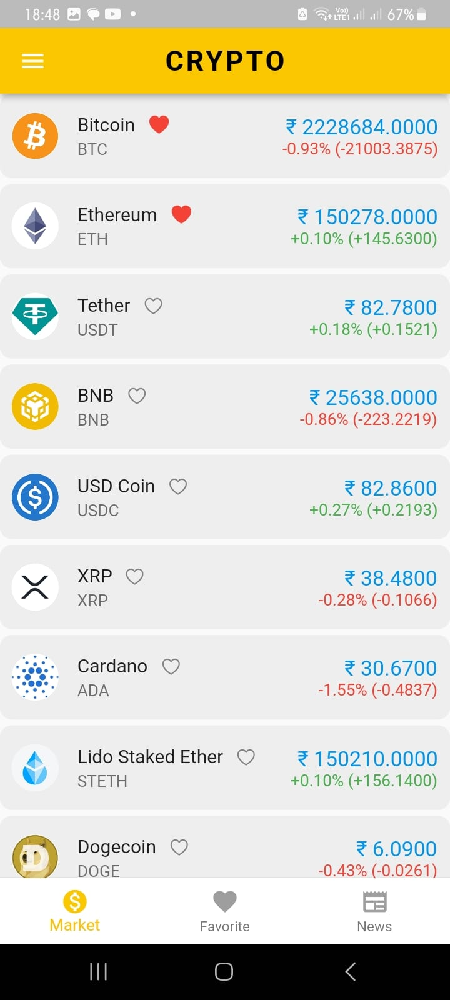
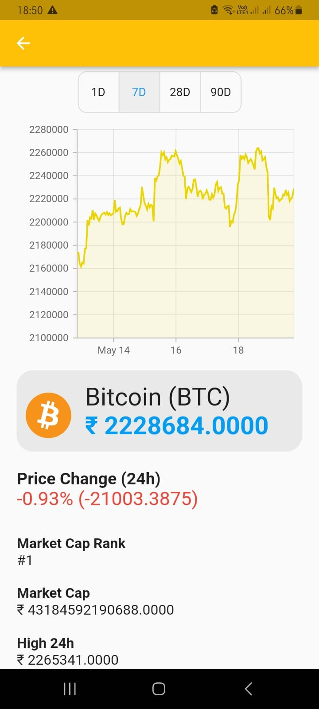

# CryptoHunt 

CryptoHunt is a cryptocurrency price tracker application built using Flutter and Dart. It allows users to track the latest prices and trends of various cryptocurrencies in real-time. The application utilizes the CoinGecko API to fetch cryptocurrency data and Syncfusion Charts to visualize the price fluctuations.

## Features 
* Real-time cryptocurrency price tracking using coingecko api
* Interactive charts for visualizing price history
* Track Favorite coins 
* User-friendly and intuitive interface
* see latest crypto currency news through https://n59der.deta.dev/

# screenshots 

{:width="300px"}
{:width="300px"}
{:width="300px"}
{:width="300px"}
{:width="300px"}